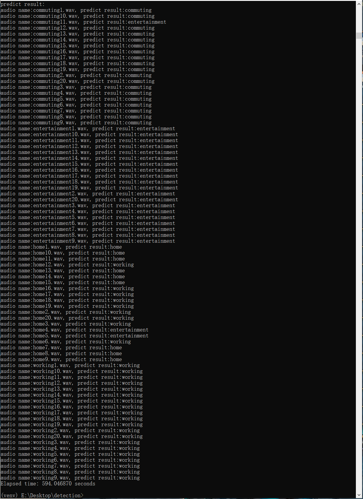
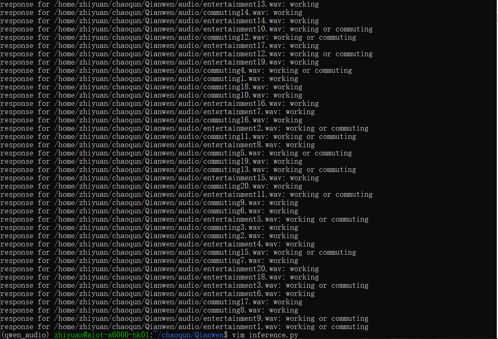
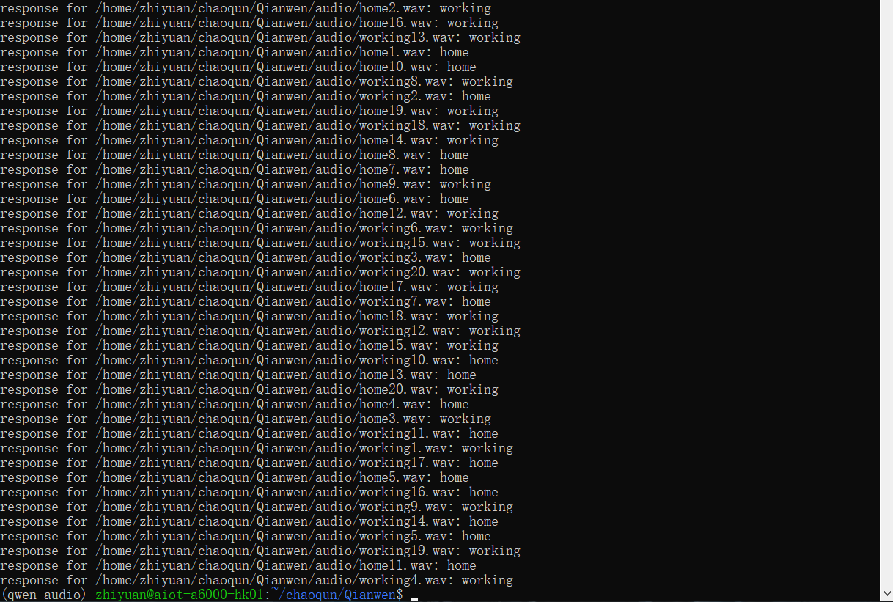

github link: https://github.com/ThingX-Technology/scene_detection.git

### 聚类实现场景判断

#### 实现原理：

​	将音频进行分窗，在滑动窗口的过程中判断每个窗口的event，最后统计整个音频中各种event出现的次数情况 ( 判断event种类是通过预训练好的模型sherpa-onnx实现 )。在预测之前，统计所有训练集在不同场景下的event出现的次数占总窗口数的比例，并以表格形式保存。这样可以得到训练集在每个场景中，event占比的点状图像 ( 纵坐标为所占百分比，横坐标为event的种类 )。在这之后，将待预测音频的event占比图像与这四种场景下的图像进行比较，得出图像最相似的一种，从而判断出属于哪个场景。

#### 测试结果：



total: 68/80 ( 85% )

- commuting: 19/20
- entertainment: 20/20
- home: 9/20
- working: 20/20


### 大模型实现场景判断

#### 实现原理：

##### prompt

```python
conversation.append({
        "role": "user",
        "content": [
            {"type": "audio", "audio_url": audio_path},
            {"type": "text", "text": "Determine which scene of the current audio is closest to, entertainment or home or working or commuting? Just need to give me one answer."}
        ]
    })
```

#### 测试结果：





total: 26/80 ( 32.5% )

- commuting: 6/20
- entertainment: 0/20
- home: 9/20
- working: 11/20